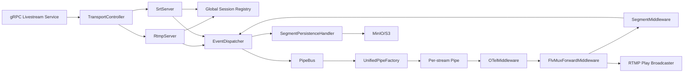

# livestream-rs

Rust 实现的直播接入与分发服务，支持 SRT/RTMP ingest、统一 RTMP egress，以及 TS 分段上传到 MinIO/S3。  
A Rust live ingest/distribution service with SRT/RTMP ingest, unified RTMP egress, and TS segment persistence to MinIO/S3.

## 功能特性 / Features

- SRT ingest（动态端口分配）/ SRT ingest with dynamic port allocation
- RTMP ingest + RTMP egress（同一服务内统一处理）/ RTMP ingest + RTMP egress in one service
- gRPC 控制面（Start/Stop/List/Get/Watch）/ gRPC control plane (Start/Stop/List/Get/Watch)
- 基于中间件链的统一媒体处理管道 / Unified media processing pipeline via middleware chain
- 分段完成事件驱动上传 MinIO/S3 / Event-driven segment upload to MinIO/S3
- OpenTelemetry 指标与链路（按环境变量启用）/ OpenTelemetry metrics and tracing (env-enabled)

## 快速开始 / Quick Start

### 本地构建 / Local Build

```bash
# Ubuntu / Debian
sudo apt-get install -y build-essential clang libclang-dev pkg-config \
  libssl-dev libavcodec-dev libavformat-dev libavutil-dev protobuf-compiler

cargo build --release
```

### 运行示例 / Run Example

```bash
export SRT__PORTS=4000-4100
export PERSISTENCE__DURATION=10
export PERSISTENCE__CACHE_DIR=
export GRPC__PORT=50051
export RTMP__PORT=1935
export RTMP__APP_NAME=lives
export RTMP__SESSION_TTL_SECS=30
export HTTP_FLV__ENABLED=true
export HTTP_FLV__PORT=8080
export MINIO_URI=http://localhost:9000
export MINIO_ACCESSKEY=minioadmin
export MINIO_SECRETKEY=miniokey
export MINIO_BUCKET=videos
export RUST_LOG=info

./target/release/livestream-rs
```

HTTP-FLV 播放地址示例：`http://127.0.0.1:8080/lives/<live_id>.flv`  
Example HTTP-FLV playback URL: `http://127.0.0.1:8080/lives/<live_id>.flv`

### Docker 构建 / Docker Build

```bash
docker build -t livestream-rs .
```

## 配置 / Configuration

配置来源：`config.toml` + 环境变量（环境变量覆盖文件）。  
Configuration source: `config.toml` + environment variables (env overrides file).

环境变量使用 `__` 表示嵌套层级，例如 `RTMP__APP_NAME` 对应 `rtmp.app_name`。MinIO 同时兼容原有的 `MINIO_URI`、`MINIO_ACCESSKEY`、`MINIO_SECRETKEY`、`MINIO_BUCKET`。  
Environment variables use `__` to express nesting, for example `RTMP__APP_NAME` maps to `rtmp.app_name`. MinIO also keeps compatibility with the legacy `MINIO_URI`, `MINIO_ACCESSKEY`, `MINIO_SECRETKEY`, and `MINIO_BUCKET` names.

关键配置项 / Key settings:

- `srt.ports` / `SRT__PORTS`
- `persistence.duration` / `PERSISTENCE__DURATION`
- `persistence.cache_dir` / `PERSISTENCE__CACHE_DIR`
- `grpc.port` / `GRPC__PORT`
- `rtmp.port` / `RTMP__PORT`
- `rtmp.app_name` / `RTMP__APP_NAME`
- `rtmp.session_ttl_secs` / `RTMP__SESSION_TTL_SECS`
- `queue.*` / `QUEUE__*`
- `minio.uri/access_key/secret_key/bucket` / legacy `MINIO_*`

`rtmp.session_ttl_secs` 默认值为 30 秒，允许范围为 0..=86400 秒。  
`rtmp.session_ttl_secs` defaults to 30 seconds, with a valid range of 0..=86400 seconds.

最小必需项：`MINIO_*` 必填，否则启动失败。  
Minimum required: `MINIO_*` must be provided, otherwise startup fails.

## gRPC API

定义见 `proto/livestream.proto`。  
Definitions are in `proto/livestream.proto`.

- `StartLivestream`
- `StopLivestream`
- `ListLivestreams`
- `GetLivestreamInfo`
- `WatchLivestream`

## 架构速览 / Architecture Snapshot

`transport` 负责连接与会话，`pipeline` 负责媒体处理，二者通过事件和有界通道解耦协作。  
`transport` handles connections/sessions, `pipeline` handles media processing, and both collaborate via events and bounded channels.



## transport 与 pipeline 的协作主线 / Main Collaboration Flow

1. gRPC 调用进入 `TransportController`，下发控制命令到 RTMP/SRT server。  
gRPC calls enter `TransportController`, which dispatches control commands to RTMP/SRT servers.
2. transport 侧在会话初始化后发布 `SessionInit/SessionStarted` 事件。  
transport publishes `SessionInit/SessionStarted` events after session initialization.
3. `PipeBus` 监听事件并按 `live_id` 创建独立管道。  
`PipeBus` listens to events and creates isolated per-`live_id` pipelines.
4. 媒体包进入中间件链，完成计量、转发、分段与持久化触发。  
Media packets go through middleware chain for metering, forwarding, segmentation, and persistence triggering.

## 文档 / Documentation

- 关键组件与架构设计要点：`docs/transport-pipeline-architecture.md`  
Detailed component and architecture-principles guide: `docs/transport-pipeline-architecture.md`
- 架构演进待办：`docs/TODOs.md`  
Architecture evolution backlog: `docs/TODOs.md`
- FFmpeg unsafe 所有权：`docs/ffmpeg-unsafe-ownership-map.md`  
FFmpeg unsafe ownership map: `docs/ffmpeg-unsafe-ownership-map.md`

## License

See [LICENSE](LICENSE).
