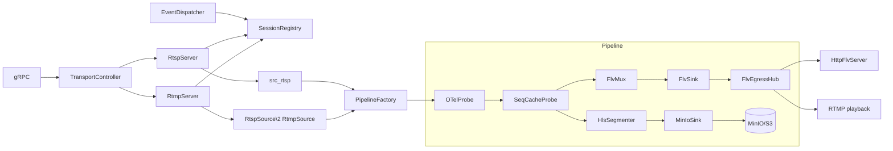

# livestream-rs

Rust 实现的直播接入与分发服务，支持 RTMP/RTSP ingest、HTTP-FLV 播放，以及 HLS TS 分段上传到 MinIO/S3。
A Rust live ingest/distribution service with RTMP/RTSP ingest, HTTP-FLV playback, and HLS TS segment persistence to MinIO/S3.

## 功能特性 / Features

- RTMP ingest（推流）+ HTTP-FLV playback（拉流）
- RTSP ingest（ANNOUNCE/SETUP/RECORD，基于 rtsp-types）
- gRPC 控制面（StartLivestream, StopLivestream, ListLivestreams, GetLivestreamInfo, WatchLivestream）
- 统一媒体处理管道（Processor/Sink 模型，有界通道反压）
- HLS 分段 → MinIO/S3 上传（内存缓冲，异步上传）
- FlvBroadcast 多订阅者 FLV 分发
- SessionRegistry 全局会话管理 + EventDispatcher 事件广播
- OpenTelemetry 指标（按 feature 启用）
- Pipeline shutdown 排空（5s 超时，逆序 close Processor）

## 快速开始 / Quick Start

### 本地构建 / Local Build

```bash
# Ubuntu / Debian
sudo apt-get install -y build-essential clang libclang-dev pkg-config \
  libssl-dev libavcodec-dev libavformat-dev libavutil-dev protobuf-compiler

cargo build --release
```

### 运行示例 / Run Example

```bash
export RTMP__PORT=1935
export RTMP__APP_NAME=lives
export RTMP__SESSION_TTL_SECS=30
export RTSP__PORT=8554
export HTTP_FLV__ENABLED=true
export HTTP_FLV__PORT=8080
export GRPC__PORT=50051
export SEGMENT__DURATION_SECS=10
export SEGMENT__CACHE_DIR=/tmp/livestream-segments
export MINIO__URI=http://localhost:9000
export MINIO__ACCESS_KEY=minioadmin
export MINIO__SECRET_KEY=miniokey
export MINIO__BUCKET=videos
export RUST_LOG=info

cargo run --release
```

HTTP-FLV 播放地址示例：`http://127.0.0.1:8080/lives/<live_id>.flv`

## 配置 / Configuration

配置来源：`config.toml` + 环境变量（环境变量覆盖文件）。
环境变量使用 `__` 表示嵌套层级，例如 `RTMP__APP_NAME` 对应 `rtmp.app_name`。

关键配置项 / Key settings:

| 环境变量 | 说明 |
|----------|------|
| `RTMP__PORT` | RTMP ingest 端口（默认 1935） |
| `RTMP__APP_NAME` | RTMP application name |
| `RTMP__SESSION_TTL_SECS` | RTMP 预创建会话超时（默认 30s） |
| `RTSP__PORT` | RTSP ingest 端口（默认 8554） |
| `HTTP_FLV__ENABLED` | 启用 HTTP-FLV 播放端点 |
| `HTTP_FLV__PORT` | HTTP-FLV 端口（默认 8080） |
| `RTMP__MAX_CONNECTIONS` | RTMP 最大并发连接数（默认 1000，0=无限制） |
| `RTSP__MAX_CONNECTIONS` | RTSP 最大并发连接数（默认 1000，0=无限制） |
| `HTTP_FLV__MAX_CONNECTIONS` | HTTP-FLV 最大并发连接数（默认 2000，0=无限制） |
| `GRPC__PORT` | gRPC 控制面端口（默认 50051） |
| `SEGMENT__DURATION_SECS` | HLS 分段时长（秒） |
| `SEGMENT__CACHE_DIR` | 分段暂存目录 |
| `MINIO__URI` | MinIO/S3 endpoint（必填） |
| `MINIO__ACCESS_KEY` | Access key（必填） |
| `MINIO__SECRET_KEY` | Secret key（必填） |
| `MINIO__BUCKET` | Bucket name（必填） |
| `QUEUE__*` | 通道容量配置 |

MinIO 配置缺失时，服务仍可启动但 HLS 分段上传功能将静默禁用。`NullUploader` 会自动丢弃所有分段。

## gRPC API

定义见 `proto/livestream.proto`。

- `StartLivestream` — 预创建 RTMP/RTSP 会话
- `StopLivestream` — 终止活跃会话
- `ListLivestreams` — 列出所有当前会话
- `GetLivestreamInfo` — 查询单个会话状态
- `WatchLivestream` — 流式订阅会话生命周期事件

## 架构 / Architecture

### Crate 结构 / Crate Layout

```
livestream-rs (binary)
├── livestream-core       — 共享 trait、类型、Pad 通道、PipelineState
├── livestream-codec      — EncodedPacket、FlvTag、RtpPacket、TsSegment
├── livestream-media      — FFmpeg 封装（解码器/编码器/Scaler/HLS muxer）
├── livestream-pipeline   — 媒体处理管道（Processor/Sink 链、PipelineGraph、PipelineImpl）
├── livestream-transport  — 协议接入（RTMP/RTSP）、HTTP-FLV、gRPC、会话管理
└── livestream-telemetry  — OpenTelemetry 指标与追踪
```

依赖方向：`binary → transport → pipeline → media/codec/core`，`pipeline` 不依赖 `transport`。

### 数据流 / Data Flow


```mermaid
flowchart LR
  grpc[gRPC] --> tc[TransportController]
  tc --> rtmp[RtmpServer]
  tc --> rtsp[RtspServer]

  rtmp --> registry[SessionRegistry]
  rtsp --> registry

  rtmp --> src_rtmp[RtspSource\2 RtmpSource]
  rtsp --> src_rtsp

  src_rtmp --> factory[PipelineFactory]
  src_rtsp --> factory

  subgraph Pipeline
    otel[OTelProbe] --> cache[SeqCacheProbe]
    cache --> flvmux[FlvMux] --> flvsink[FlvSink] --> hub[FlvEgressHub]
    cache --> hls[HlsSegmenter] --> minio_sink[MinIoSink] --> s3[(MinIO/S3)]
  end

  factory --> otel
  hub --> http_flv[HttpFlvServer]
  hub --> rtmp_play[RTMP playback]

  dispatcher[EventDispatcher] --> registry
```

### 关键组件 / Key Components

**Transport 层：**
- `TransportServer` — 聚合 RTMP/RTSP/HTTP-FLV server 统一生命周期
- `TransportController` — 控制面命令分发（PrecreateStream / StopStream）
- `RtmpServer` — RTMP ingest + 预创建 TTL 管理
- `RtspServer` — RTSP ANNOUNCE/SETUP/RECORD/TEARDOWN，RTP 交错帧读取
- `HttpFlvServer` — HTTP-FLV 播放端点（`/lives/{live_id}.flv`）+ 健康检查端点
- `GrpcServer` — gRPC 控制面实现
- `FlvEgressHub` — 每流 FLV 广播通道，订阅者通过 `FlvBroadcast` trait 接入
- `SessionRegistry` — 全局会话描述 + CancellationToken + PipelineHandle 管理
- `EventDispatcher` — `SessionEvent`（Started/Init/Ended + EndReason）广播

**Pipeline 层：**
- `PipelineFactory` — 持有共享依赖（MinIO、SegmentConfig、FlvBroadcast），构建管道实例
- `PipelineImpl` — 管道运行时：tasks 管理、shutdown 排空（5s 超时）
- `PipelineHandle` — `PipelineState`（AtomicU8）+ `CancellationToken`
- Processor 链：`OTelProbe` → `SeqCacheProbe` → fan-out → `FlvMux`/`HlsSegmenter`
- Sink：`FlvSink`（广播 FLV 到 FlvEgressHub）、`MinIoSink`（上传 TS 分段到 MinIO）

### 管道结构 / Pipeline Structure

```
Source (EncodedPacket)
  → OTelProbe (passthrough + metrics)
  → SeqCacheProbe (缓存 seq header + recent keyframe)
  → [fan-out]
    ├→ FlvMux (EncodedPacket → FlvTag) → FlvSink → FlvEgressHub
    └→ HlsSegmenter (EncodedPacket → TsSegment) → MinIoSink → MinIO/S3

Source (RtpPacket, RTSP):
  → RtpDemuxProcessor (RtpPacket → EncodedPacket, FFmpeg RTP demuxer)
  → 进入上述 EncodedPacket 链
```

### 设计原则 / Design Principles

- **分层职责**：transport 处理连接/会话，pipeline 处理媒体/内容
- **事件驱动解耦**：会话生命周期通过 `EventDispatcher` 广播
- **按流隔离**：每 `live_id` 独立管道实例，无跨流状态污染
- **有界通道反压**：`PadSender`/`PadReceiver` 有界通道控制突发流量
- **RAII 资源管理**：FFmpeg 原始指针封装在 media crate，pipeline 只传递类型化包
- **Result pattern**：`anyhow::Result` 用于应用级错误，无 panic 业务路径

## 文档 / Documentation

- 架构详细说明：`docs/transport-pipeline-architecture.md`
- FFmpeg unsafe 所有权映射：`docs/ffmpeg-unsafe-ownership-map.md`

## License

See [LICENSE](LICENSE).
