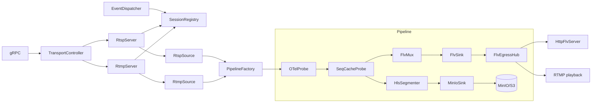

# livestream-rs

Rust 实现的直播接入与分发服务，支持 RTMP/RTSP ingest、HTTP-FLV / RTMP 播放，以及 HLS TS 分段上传到 MinIO/S3。
A Rust live ingest/distribution service with RTMP/RTSP ingest, HTTP-FLV/RTMP playback, and HLS TS segment persistence to MinIO/S3.

## 功能特性 / Features

- RTMP ingest（推流）+ HTTP-FLV / RTMP playback（拉流）
- RTSP ingest（ANNOUNCE/SETUP/RECORD/TEARDOWN，基于 rtsp-types）
- 服务端转码：RTSP MJPEG（RFC 2435）→ H.264（FLV/HLS muxer 均不支持 MJPEG 封装）
- gRPC 控制面（StartLivestream, StopLivestream, ListLivestreams, GetLivestreamInfo, WatchLivestream, GetServiceInfo）+ reflection，可选 Bearer token 认证
- 统一媒体处理管道（Processor/Sink 模型，有界通道反压 + demand 感知）
- HLS：keyframe 对齐分段、`index.m3u8` playlist、TS/playlist 上传 MinIO/S3（磁盘暂存 + 有限重试）
- RTMP / 转码流 HLS 分支延迟初始化：SPS/PPS + ASC 序列头齐备后再构建（双 codec）
- FlvBroadcast 多订阅者 FLV 分发（sequence header 缓存，晚到订阅者快速起播）
- 健康端点 `/alive`、`/health`、`/health/stream/{live_id}`（独立于 FLV 播放功能）
- SessionRegistry 全局会话管理 + EventDispatcher 事件广播（`EndReason` 区分终止原因）
- OpenTelemetry 指标（按 feature 启用）+ 管道错误计数器
- Pipeline shutdown 排空（5s 超时，超时任务中止兜底）
- 防护：连接数上限（RTMP/RTSP/HTTP-FLV，0=无限制）、RTMP chunk size 钳制、RTSP 消息大小上限、stream_id 消毒

## 快速开始 / Quick Start

### 本地构建 / Local Build

```bash
# Ubuntu / Debian
sudo apt-get install -y build-essential clang libclang-dev pkg-config \
  libssl-dev libavcodec-dev libavformat-dev libavutil-dev libswscale-dev \
  protobuf-compiler

cargo build --release
```

### 运行示例 / Run Example

```bash
export RTMP__PORT=1935
export RTMP__APP_NAME=lives
export RTMP__SESSION_TTL_SECS=30
export RTSP__PORT=8554
export HTTP_FLV__ENABLED=true
export HTTP_FLV__PORT=8080
export GRPC__PORT=50051
export SEGMENT__DURATION_SECS=10
export SEGMENT__CACHE_DIR=/tmp/livestream-segments
export MINIO__URI=http://localhost:9000
export MINIO__ACCESS_KEY=minioadmin
export MINIO__SECRET_KEY=miniokey
export MINIO__BUCKET=videos
export RUST_LOG=info

cargo run --release
```

HTTP-FLV 播放地址示例：`http://127.0.0.1:8080/lives/<live_id>.flv`
RTMP 拉流地址示例：`rtmp://127.0.0.1:1935/lives/<live_id>`

### 测试 / Testing

```bash
# 单元 + 集成测试（各 crate 自带 #[cfg(test)]，transport/pipeline 有 tests/ 集成测试）
cargo test --workspace

# 自动化 E2E（构建 → 启动服务 → RTMP 推流 → HTTP-FLV 拉流校验 → RTSP MJPEG 推流 → 转码后 HTTP-FLV 校验）
./scripts/e2e-test.sh

# 压测工具（livestream-test-utils，dual-mode）
cargo run --release -p livestream-test-utils -- --help
```

## 配置 / Configuration

配置来源：`config.toml`（可选）+ 环境变量（环境变量覆盖文件）。
环境变量使用 `__` 表示嵌套层级，例如 `RTMP__APP_NAME` 对应 `rtmp.app_name`。
顶层结构：`transport`、`services`、`storage`、`queue`、`transcode`。

关键配置项 / Key settings:

| 环境变量 | 说明 |
|----------|------|
| `RTMP__PORT` | RTMP ingest 端口（默认 1935） |
| `RTMP__APP_NAME` | RTMP application name（默认 `lives`） |
| `RTMP__SESSION_TTL_SECS` | RTMP 预创建会话超时（默认 30，范围 1–86400） |
| `RTMP__MAX_CONNECTIONS` | RTMP 最大并发连接数（默认 1000，0=无限制） |
| `RTSP__PORT` | RTSP ingest 端口（默认 8554） |
| `RTSP__SESSION_TTL_SECS` | RTSP 预创建会话超时（默认 30，范围 1–86400） |
| `RTSP__MAX_CONNECTIONS` | RTSP 最大并发连接数（默认 1000，0=无限制） |
| `HTTP_FLV__ENABLED` | 启用 HTTP-FLV 播放路由（默认 false；`/alive`、`/health` 始终可用） |
| `HTTP_FLV__PORT` | HTTP-FLV 端口（默认 8080） |
| `HTTP_FLV__MAX_CONNECTIONS` | HTTP-FLV 最大并发连接数（默认 2000，0=无限制） |
| `GRPC__PORT` | gRPC 控制面端口（默认 50051） |
| `GRPC__AUTH_TOKEN` | 可选：设置后所有 gRPC 请求（含 reflection）需 `authorization: Bearer <token>` |
| `SEGMENT__DURATION_SECS` | HLS 分段目标时长（秒，默认 10） |
| `SEGMENT__CACHE_DIR` | 分段暂存目录（默认系统临时目录） |
| `SEGMENT__PLAYLIST_SIZE` | playlist 保留分段数（默认 5，0=无限） |
| `SEGMENT__MINIO_PREFIX` | MinIO 对象键前缀（默认 `hls`） |
| `SEGMENT__MAX_STAGED_SEGMENTS` | 暂存上限配置项（默认 100；当前未强制 LRU，见下） |
| `MINIO__URI` | MinIO/S3 endpoint（必填） |
| `MINIO__ACCESS_KEY` | Access key（必填） |
| `MINIO__SECRET_KEY` | Secret key（必填） |
| `MINIO__BUCKET` | Bucket name（必填） |
| `TRANSCODE__BITRATE_KBPS` | 转码目标码率 kbps（默认 1024） |
| `TRANSCODE__PRESET` | x264 preset（默认 `veryfast`） |
| `TRANSCODE__GOP_SECS` | 转码关键帧间隔（秒，默认 2.0） |
| `TRANSCODE__FPS` | 转码输出帧率（默认跟随源） |
| `QUEUE__RTMP_FORWARD` | RTMP 源→管道通道容量（默认 8192） |
| `QUEUE__FLV_RELAY` | FLV 中继通道容量（默认 2048） |
| `QUEUE__PACKET_RELAY` | 包中继通道容量（默认 2048） |
| `QUEUE__CONTROL` | 控制消息通道容量（默认 1024） |
| `QUEUE__EVENT` | 事件通道容量（默认 4096） |

兼容旧式单下划线环境变量：`MINIO_URI` / `MINIO_ACCESSKEY` / `MINIO_SECRETKEY` / `MINIO_BUCKET`。

MinIO 配置缺失或创建客户端失败时，服务仍可启动，HLS 上传降级为 `NullUploader`（丢弃分段并打 warning），FLV 路径不受影响。分段上传失败会重试（200ms/500ms 退避，共 2 次），上传成功或最终失败后均清理暂存文件；`SEGMENT__MAX_STAGED_SEGMENTS` 的 LRU 淘汰逻辑尚未实现（见 `docs/data-flow-architecture.md` Known Gaps）。

## gRPC API

定义见 `proto/livestream.proto`（服务实现 + tonic reflection）。

- `StartLivestream` — 预创建 RTMP/RTSP 会话，返回 `StreamDescriptor`（含 ingest/playback 端点）；重复 live_id 返回 ALREADY_EXISTS
- `StopLivestream` — 终止活跃会话（不存在返回 NOT_FOUND）
- `ListLivestreams` — 列出所有当前会话
- `GetLivestreamInfo` — 查询单个会话状态
- `WatchLivestream` — 流式订阅会话状态变化（`SessionStatus`）
- `GetServiceInfo` — 返回各协议监听端口（未启用为 0）

设置 `GRPC__AUTH_TOKEN` 后，所有请求（含 reflection）必须携带 `authorization: Bearer <token>`，否则返回 UNAUTHENTICATED。

## 架构 / Architecture

### Crate 结构 / Crate Layout

```
livestream-rs (binary)
├── livestream-core       — 共享 trait、类型、Pad 通道、PipelineState、配置类型
├── livestream-codec      — EncodedPacket、FlvTag、RtpPacket、TsSegment、SegmentConfig
├── livestream-media      — FFmpeg 封装（Decoder/Encoder/Scaler/RTP demux/HLS muxer/BSF）
├── livestream-pipeline   — 媒体处理管道（Processor/Sink 链、PipelineImpl、PipelineFactory）
├── livestream-transport  — 协议接入（RTMP/RTSP）、HTTP-FLV、gRPC、会话管理
└── livestream-telemetry  — OpenTelemetry 指标与追踪
```

依赖方向：`binary → transport → pipeline → media/codec/core`，`pipeline` 不依赖 `transport`（通过 `FlvBroadcast`/`ObjectUploader` trait 注入）。

### 数据流 / Data Flow


```mermaid
flowchart LR
  grpc[gRPC] --> tc[TransportController]
  tc --> rtmp[RtmpServer]
  tc --> rtsp[RtspServer]

  rtmp --> registry[SessionRegistry]
  rtsp --> registry

  rtmp --> src_rtmp[RtmpSource]
  rtsp --> src_rtsp[RtspSource]

  src_rtmp --> factory[PipelineFactory]
  src_rtsp --> factory

  subgraph Pipeline
    otel[OTelProbe] --> cache[SeqCacheProbe]
    cache --> flvmux[FlvMux] --> flvsink[FlvSink] --> hub[FlvEgressHub]
    cache --> hls[HlsSegmenter] --> minio_sink[MinIoSink] --> s3[(MinIO/S3)]
  end

  factory --> otel
  hub --> http_flv[HttpFlvServer]
  hub --> rtmp_play[RTMP playback]

  dispatcher[EventDispatcher] --> registry
```

### 关键组件 / Key Components

**Transport 层：**
- `ProtocolServerCore` — RTMP/RTSP 共享的 accept/控制消息/预创建 TTL 主循环（`protocol_server.rs`），任务由 `JoinSet` 跟踪，关闭时排空
- `RtmpServer` / `RtspServer` — 协议特定连接处理（RTMP `SessionGuard` + publish/play handler；RTSP `RtspSession` 状态机 + RTP 交错帧读取）
- `HttpFlvServer` — `/lives/{live_id}.flv` 播放 + `/alive`、`/health`、`/health/stream/{live_id}` 健康端点
- `GrpcServer` — gRPC 控制面 + reflection + 可选 Bearer auth
- `FlvEgressHub` / `FlvLiveChannel` — 每流 FLV 广播通道 + sequence header 缓存 + 订阅 demand 信号
- `SessionRegistry` / `EventDispatcher` / `HandlerLifecycle` — 会话注册、事件广播（Started/Init/Ended + EndReason）、状态机（幂等断开）

**Pipeline 层：**
- `PipelineFactory` — 自由函数：`build_pipeline`（RTMP）、`build_rtsp_pipeline`（RTP + 可选转码）、`build_encoded_chain`；`null_uploader()` 为 dev 提供 No-op 上传器
- `PipelineImpl` — 管道运行时：tasks 管理、shutdown 排空（5s 超时，late-registered 任务中止兜底）
- `TranscodeProcessor` — MJPEG → H.264 服务端转码（FFmpeg 状态串行化于单 Mutex）
- Processor 链：`OTelProbe` → `SeqCacheProbe` → fan-out → `FlvMux` / `HlsSegmenter`（RTMP 与转码源延迟初始化 HLS）
- Sink：`FlvSink`（广播 FLV 到 FlvEgressHub）、`MinIoSink`（上传 TS/playlist 到 MinIO，有限重试）

### 管道结构 / Pipeline Structure

```
RTMP Source (EncodedPacket，source 边界 AVCC → Annex B)
  → OTelProbe (passthrough + metrics)
  → SeqCacheProbe (缓存 seq header + 最近 keyframe)
  → [fan-out]
    ├→ FlvMux (EncodedPacket → FlvTag，纯 Rust) → FlvSink → FlvEgressHub
    └→ HlsSegmenter (EncodedPacket → TsSegment，keyframe 对齐) → MinIoSink → MinIO/S3
        （延迟初始化：SPS/PPS + ASC 序列头齐备后构建）

RTSP Source (RtpPacket):
  → RtpDemuxProcessor (RtpPacket → EncodedPacket，FFmpeg RTP demuxer)
  → [MJPEG 流] TranscodeProcessor (MJPEG → H.264，输出自带序列头)
  → 进入上述 EncodedPacket 链（转码流同样延迟初始化 HLS）
```

### 设计原则 / Design Principles

- **分层职责**：transport 处理连接/会话，pipeline 处理媒体/内容
- **事件驱动解耦**：会话生命周期通过 `EventDispatcher` 广播
- **按流隔离**：每 `live_id` 独立管道实例，无跨流状态污染
- **有界通道反压**：`PadSender`/`PadReceiver` 有界通道控制突发流量；demand 感知避免无效处理
- **RAII 资源管理**：FFmpeg 原始指针封装在 media crate（`unsafe` 仅限该 crate），pipeline 只传递类型化包
- **Result pattern**：`anyhow::Result` 用于应用级错误，无 panic 业务路径
- **优雅降级**：MinIO 缺失 → HLS 禁用 FLV 照常；HLS 构建失败 → 仅 FLV；HTTP-FLV 失败 → 健康端点仍可用；gRPC 启动失败 → 进程退出（控制面必需）
- **观众不影响推流**：订阅者断开不终止推流管道，慢消费者通过 keyframe 跳帧追赶

## 文档 / Documentation

- 架构详细说明：`docs/transport-pipeline-architecture.md`
- 数据流与组件：`docs/data-flow-architecture.md`
- FFmpeg unsafe 所有权映射：`docs/ffmpeg-unsafe-ownership-map.md`

## License

See [LICENSE](LICENSE).
